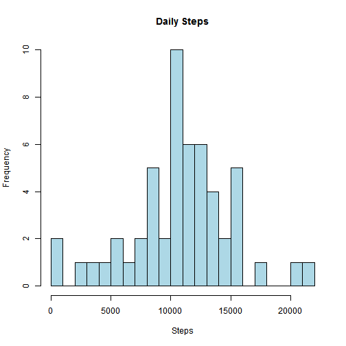
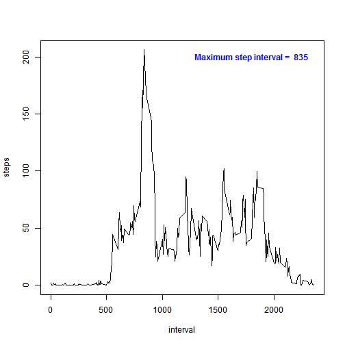
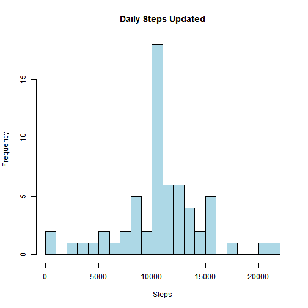
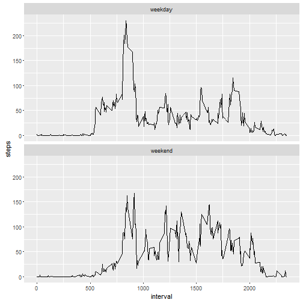

## Loading and preprocessing the data

```r
activity <- read.csv("activity.csv")
activity = transform(activity, date=as.Date(date))
```

## Total number of steps taken per day

```r
dailySteps <- aggregate(steps ~ date, data=activity, FUN=sum)
hist(x=dailySteps$steps, breaks=20, main="Daily Steps", xlab="Steps", col="lightblue")
```



## What is the mean and median total number of steps taken per day?

```r
mean(dailySteps$steps)
```

```
## [1] 10766.19
```

```r
median(dailySteps$steps)
```

```
## [1] 10765
```

## What is the average daily activity pattern?

```r
intervals <- aggregate(steps ~ interval, data=activity, FUN=mean)
maxInterval <- intervals$interval[intervals$steps == max(intervals$steps)]
plot(steps ~ interval, data=intervals, type="l")
text(1800, 200, paste("Maximum step interval = ", maxInterval), col="blue", font=2)
```



## Imputing missing values

- Number of rows with missing values

```r
sum(is.na(activity))
```

```
## [1] 2304
```
- Key/value structure that maps each interval to its step average

```r
means <- aggregate(activity$steps, by=list(activity$interval), mean, na.rm=TRUE)
mean_map <- round(means[,2])
names(mean_map) <- means[,1]
```

- Replace missing step values with the rounded mean of the individual intervals

```r
activity_updated = activity
missing <- which(is.na(activity_updated))
activity_updated[missing,1] = mean_map[as.character(activity_updated[missing,3])]
```
- Updated number of rows with missing values

```r
sum(is.na(activity_updated))
```

```
## [1] 0
```

- Updated Total number of steps taken per day

```r
dailySteps <- aggregate(steps ~ date, data=activity_updated, FUN=sum)
hist(x=dailySteps$steps, breaks=20, main="Daily Steps Updated", xlab="Steps", col="lightblue")
```



*Replacing the missing values with the inverval averages altered only one
 histogram bar. This does not add much insight into the data analysis.*
 
<br />

- What is the updated mean and median total number of steps taken per day?

```r
mean(dailySteps$steps)
```

```
## [1] 10765.64
```

```r
median(dailySteps$steps)
```

```
## [1] 10762
```

*Since the missing values were across the entirety of only 8 days, imputed
 values little effect on the mean or median.*

</br>

## Are there differences in activity patterns between weekdays and weekends?
- Add a new factor column representing a "weekday" or "weekend" for the date

```r
activity_updated$daytype = factor(
        ifelse(weekdays(activity_updated$date) %in% c("Saturday", "Sunday"),
                "weekend", "weekday"))
table(activity_updated$daytype)
```

```
## 
## weekday weekend 
##   12960    4608
```
- Time series plot of the average steps taken during each 5-minute interval

```r
library(ggplot2)
stepavgs <- aggregate(activity_updated$steps,
        by=list(activity_updated$interval, activity_updated$daytype), mean)
names(stepavgs) <- c("interval", "daytype", "steps")
ggplot(stepavgs, aes(x=interval, y=steps)) + facet_wrap(~daytype, ncol=1) + geom_line()
```



*On weekdays there is more step activity in the morning hours and during times
 near the end of the work day.*
<br />
*On weekends there is more activity in the afternoon and later evening hours
 compared to those same hours on weekdays.*
